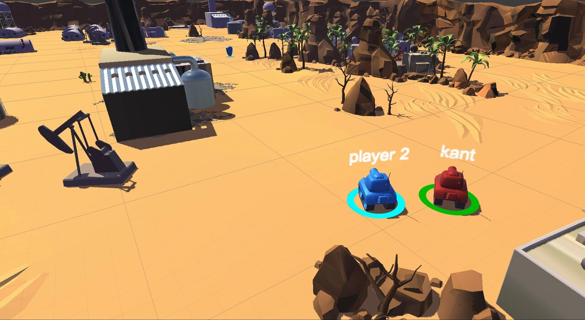

# Tanks Multiplayer 3D

A top-down 3D tank shooter for mobile, built with Unity. Play solo rounds against AI bots or join a team deathmatch over Photon.

## Game modes

### Single player

Round-based battle against AI tanks on a desert map.

- Bots drive around the map on a NavMesh, head for the player once they are in range and drop the chase when the player gets too far away.
- Aiming is predictive: a bot simulates the player's position and heading one second ahead and scales the shell launch force to the distance.
- Health and shield power-ups come back 10 and 20 seconds after pickup. The shield absorbs damage before health does.
- Round results, win counters and a run timer on the final screen.

### Multiplayer

Team deathmatch on Photon PUN 2.

- Three network modes: Online (Photon Cloud), LAN (your own Photon server address) and Offline.
- Matchmaking by game mode: join a random open room or create a new one when none is found.
- Players are assigned to the team with the fewest members, respawn after a countdown and play until a team reaches the score limit.
- Pickups are validated on the master client; bullets and particle effects are pooled.

## Controls

On-screen joystick to drive and turn, plus a fire button: hold to charge the shot, release to fire.

## Tech

- Unity 2020.1 (`2020.1.0a19`), C#
- Photon PUN 2 (2.16) for networking
- Unity NavMesh and NavMeshComponents for bot navigation
- Post Processing Stack and baked lighting
- Joystick Pack for touch input

## Project layout

| Path | Contents |
| --- | --- |
| `Assets/Scenes/startScreen.unity` | Main menu: single player, multiplayer, exit |
| `Assets/Scenes/Main.unity` | Single player map |
| `Assets/Scenes/MultiplayerMenu.unity` | Multiplayer menu: player name, network mode, settings |
| `Assets/Scenes/TDM_Main.unity` | Team deathmatch map |
| `Assets/Scripts/Tank`, `Managers`, `Shell`, `Camera`, `UI` | Single player gameplay, bot AI and UI |
| `Assets/Scripts/Multiplayer` | Networking, players, bots, pickups and pooling |

## Running it

1. Clone the repo. It is large, about 600 MB.
2. Open the project in Unity 2020.1. Newer versions will offer to upgrade it.
3. For online play, set your own Photon App ID in `Assets/Photon/PhotonUnityNetworking/Resources/PhotonServerSettings`.
4. Open `Assets/Scenes/startScreen.unity` and press Play, or build for iOS or Android.

## Credits

- Tank models, sounds and the core tank mechanics come from Unity's [Tanks! tutorial project](https://assetstore.unity.com/packages/templates/packs/tanks-3d-sample-project-46209).
- The multiplayer layer is based on the [Tanks Multiplayer](https://assetstore.unity.com/packages/templates/tutorials/tanks-multiplayer-netcode-photon-69172) template by Rebound Games.
- Networking by [Photon PUN 2](https://www.photonengine.com/pun).
- Touch input by [Joystick Pack](https://assetstore.unity.com/packages/tools/input-management/joystick-pack-107631).

Third-party assets remain under their own licenses.
